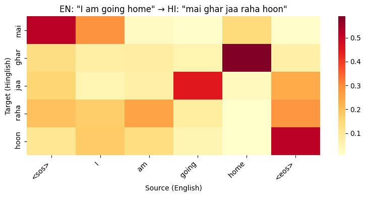
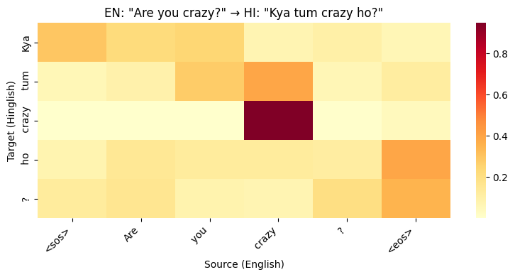
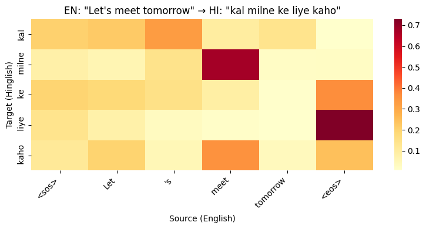

# English → Hinglish Neural Machine Translation

A **from-scratch Transformer** encoder-decoder for translating English into Hinglish (Romanized Hindi-English code-mixed text), trained on 150k+ parallel sentence pairs.

## Results

| Metric | Score |
|--------|-------|
| **BLEU** | **58.35** |
| **chrF** | **74.69** |
| Test Set | 9,244 sentences |
| Training | 20 epochs on Google Colab Pro (T4) |

### Sample Translations

| English | Hinglish Output |
|---------|----------------|
| I am going home | mai ghar jaa raha hoon |
| Are you crazy? | Kya tum crazy ho? |
| What is your name? | aap ka naam kya hai? |
| Can you help me with this? | Kya aap muje is ke sath help kar sakte he? |
| I need to buy some groceries | mujhe kuch groceries kharidne ki zarurat hai |
| My phone is not working | mera phone nahi chal raha hai |
| He is my best friend | Wo mera best friend hai |
| I forgot my wallet at home | mai ghar me apna wallet bhul gaya hun |

### Attention Visualizations

Cross-attention heatmaps showing which English source words the model attends to when generating each Hinglish token (averaged across all 8 attention heads in the last decoder layer):

  
  

  

The model learns meaningful word alignments: "home" maps strongly to "ghar", "crazy" maps to "crazy" (code-switch retention), and "meet" aligns with "milne". The attention patterns confirm the model isn't just memorizing sequences — it's learning cross-lingual structure.

---

## Highlights

- **From-scratch Transformer** built entirely in PyTorch (no pre-trained weights, no HuggingFace model classes)
- **Custom BPE tokenizer** trained on mixed English + Hinglish corpus (16k shared vocab)
- **58.35 BLEU** on 9.2k test sentences (corpus-level, sacrebleu)
- **Attention visualization** showing learned word-level alignment between source and target
- **Beam search** decoding with configurable width
- **Streamlit demo** for interactive translation

## Architecture

| Component | Specification |
|-----------|---------------|
| Type | Encoder-Decoder Transformer (Seq2Seq) |
